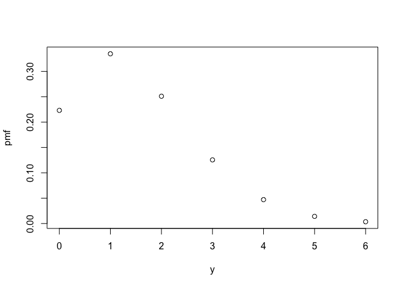
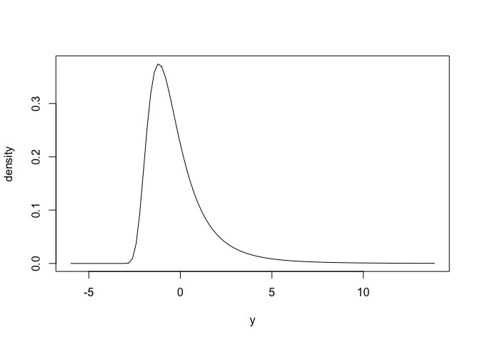
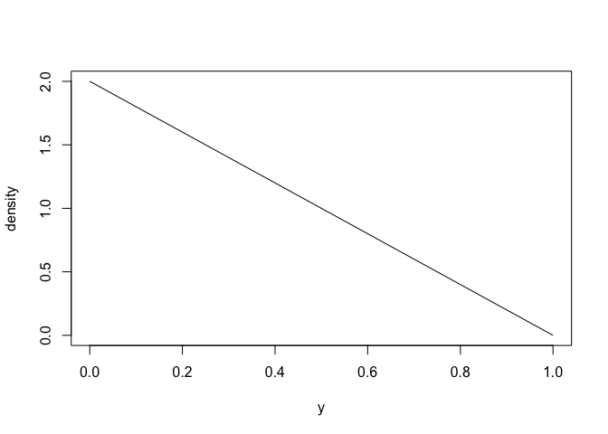

<!-- README.md is generated from README.Rmd. Please edit that file -->

# distionary 

<!-- badges: start -->

[](https://CRAN.R-project.org/package=distionary)
[](https://cran.r-project.org/web/licenses/MIT)
[](https://github.com/probaverse/distionary/actions/workflows/R-CMD-check.yaml)
[](https://app.codecov.io/gh/probaverse/distionary)
[](https://lifecycle.r-lib.org/articles/stages.html#stable)
<!-- badges: end -->

With `distionary`, you can:

1.  Specify a probability distribution, and
2.  Evaluate the probability distribution.

The main purpose of `distionary` is to make distribution calculations
available, even if they are not specified in the distribution.

The name “distionary” is a portmanteau of “distribution” and
“dictionary”. While a dictionary lists and defines words, `distionary`
makes a list of common distribution families available, and defines
distributions.

## Installation

`distionary` is not on CRAN yet. You can download the development
version from GitHub with:

``` r
# install.packages("devtools")
devtools::install_github("probaverse/distionary")
```

## Example

``` r
library(distionary)
```

**Specify** a distribution like a Poisson distribution and a Generalised
Extreme Value (GEV) distribution using the `dst_*()` family of
functions.

``` r
# Create a Poisson distribution
poisson <- dst_pois(1.5)
# Inspect
poisson
#> Poisson distribution (discrete)
#> --Parameters--
#> lambda 
#>    1.5
```

``` r
# Create a GEV distribution
gev <- dst_gev(-1, 1, 0.2)
# Inspect
gev
#> Generalised Extreme Value distribution (continuous)
#> --Parameters--
#> location    scale    shape 
#>     -1.0      1.0      0.2
```

Here is what the distributions look like, via their probability mass
(PMF) and density functions.

``` r
plot(poisson)
```



``` r
plot(gev)
```



**Evaluate** various distributional representations (functions that
fully describe the distribution), such as the PMF or quantiles. The
`eval_*()` functions simply evaluate the representation, whereas the
`enframe_*()` functions place the output alongside the input in a data
frame or tibble.

``` r
eval_pmf(poisson, at = 0:4)
#> [1] 0.22313016 0.33469524 0.25102143 0.12551072 0.04706652
enframe_quantile(gev, at = c(0.2, 0.5, 0.9))
#> # A tibble: 3 × 2
#>    .arg quantile
#>   <dbl>    <dbl>
#> 1   0.2   -1.45 
#> 2   0.5   -0.620
#> 3   0.9    1.84
```

Evaluate properties such as mean, skewness, and range of valid values.

``` r
mean(gev)
#> [1] -0.1788514
skewness(poisson)
#> [1] 0.8164966
range(gev)
#> [1]  -6 Inf
```

You can make your own distribution, too.

``` r
# Make a distribution.
linear <- distribution(
  density = function(x) {
    d <- 2 * (1 - x)
    d[x < 0 | x > 1] <- 0
    d
  },
  cdf = function(x) {
    p <- 2 * x * (1 - x / 2)
    p[x < 0] <- 0
    p[x > 1] <- 1
    p
  },
  .vtype = "continuous",
  .name = "My Linear"
)
# Inspect
linear
#> My Linear distribution (continuous)
```

Here is what it looks like (density function).

``` r
plot(linear)
```



Even though only the density and CDF are defining the distribution,
other properties can be evaluated, like its mean and quantiles

``` r
mean(linear)
#> [1] 0.3333333
enframe_quantile(linear, at = c(0.2, 0.5, 0.9))
#> # A tibble: 3 × 2
#>    .arg quantile
#>   <dbl>    <dbl>
#> 1   0.2    0.106
#> 2   0.5    0.293
#> 3   0.9    0.684
```

## Acknowledgements

The creation of `distionary` would not have been possible without the
support of the R Consortium, The Natural Science and Engineering
Research Council of Canada (NSERC), The University of British Columbia,
and BGC Engineering Inc.

## Code of Conduct

Please note that the distionary project is released with a [Contributor
Code of
Conduct](https://contributor-covenant.org/version/2/0/CODE_OF_CONDUCT.html).
By contributing to this project, you agree to abide by its terms.
