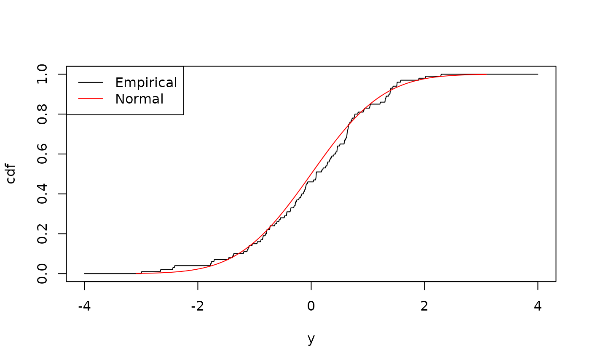

# Built-In Distributions

``` r
library(distionary)
```

This vignette covers built-in distribution families available in
`distionary`. It provides insight into each family and its counterparts
in the `stats` package.

## Built-In Distribution Families

All distribution families found in the `stats` package are integrated
into `distionary`, along with a few others. They are shown in the table
below with notes on whether they have counterparts in the `stats`
package.

| Distribution                    | `distionary` Function                                                               | Has counterpart in `stats` |
|---------------------------------|-------------------------------------------------------------------------------------|----------------------------|
| Bernoulli                       | [`dst_bern()`](https://distionary.probaverse.com/reference/dst_bern.md)             | Yes                        |
| Beta                            | [`dst_beta()`](https://distionary.probaverse.com/reference/dst_beta.md)             | Yes                        |
| Binomial                        | [`dst_binom()`](https://distionary.probaverse.com/reference/dst_binom.md)           | Yes                        |
| Cauchy                          | [`dst_cauchy()`](https://distionary.probaverse.com/reference/dst_cauchy.md)         | Yes                        |
| Chi Squared                     | [`dst_chisq()`](https://distionary.probaverse.com/reference/dst_chisq.md)           | Yes                        |
| Degenerate                      | [`dst_degenerate()`](https://distionary.probaverse.com/reference/dst_degenerate.md) | No                         |
| Exponential                     | [`dst_exp()`](https://distionary.probaverse.com/reference/dst_exp.md)               | Yes                        |
| Empirical                       | [`dst_empirical()`](https://distionary.probaverse.com/reference/dst_empirical.md)   | No                         |
| F                               | [`dst_f()`](https://distionary.probaverse.com/reference/dst_f.md)                   | Yes                        |
| Finite                          | [`dst_finite()`](https://distionary.probaverse.com/reference/dst_finite.md)         | No                         |
| Gamma                           | [`dst_gamma()`](https://distionary.probaverse.com/reference/dst_gamma.md)           | Yes                        |
| Geometric                       | [`dst_geom()`](https://distionary.probaverse.com/reference/dst_geom.md)             | Yes                        |
| Generalised Extreme Value (GEV) | [`dst_gev()`](https://distionary.probaverse.com/reference/dst_gev.md)               | No                         |
| Generalised Pareto (GP)         | [`dst_gp()`](https://distionary.probaverse.com/reference/dst_gp.md)                 | No                         |
| Hypergeometric                  | [`dst_hyper()`](https://distionary.probaverse.com/reference/dst_hyper.md)           | Yes                        |
| Log Normal                      | [`dst_lnorm()`](https://distionary.probaverse.com/reference/dst_lnorm.md)           | Yes                        |
| Log Pearson Type III            | [`dst_lp3()`](https://distionary.probaverse.com/reference/dst_lp3.md)               | No                         |
| Negative Binomial               | [`dst_nbinom()`](https://distionary.probaverse.com/reference/dst_nbinom.md)         | Yes                        |
| Normal                          | [`dst_norm()`](https://distionary.probaverse.com/reference/dst_norm.md)             | Yes                        |
| Pearson Type III                | [`dst_pearson3()`](https://distionary.probaverse.com/reference/dst_pearson3.md)     | No                         |
| Poisson                         | [`dst_pois()`](https://distionary.probaverse.com/reference/dst_pois.md)             | Yes                        |
| Student *t*                     | [`dst_t()`](https://distionary.probaverse.com/reference/dst_t.md)                   | Yes                        |
| Uniform                         | [`dst_unif()`](https://distionary.probaverse.com/reference/dst_unif.md)             | Yes                        |
| Weibull                         | [`dst_weibull()`](https://distionary.probaverse.com/reference/dst_weibull.md)       | Yes                        |

In addition, there is a special “Null” distribution object akin to a
missing or unknown distribution. This is useful, for example, if an
algorithm fails to return a distribution: instead of throwing an error,
a Null distribution can be returned.

``` r
# Make a Null distribution.
null <- dst_null()
# Inspect
null
#> Null distribution (NA)
```

This is the behaviour when specifying `NA` as a distribution parameter:

``` r
dst_norm(mean = 0, sd = NA)
#> Null distribution (NA)
```

The Null distribution always evaluates to `NA`.

``` r
mean(null)
#> [1] NA
eval_pmf(null, at = 1:10)
#>  [1] NA NA NA NA NA NA NA NA NA NA
range(null)
#> [1] NA NA
```

## The Empirical Distribution

The Empirical distribution is different from the others in terms of its
utility because it makes *your data* the distribution, and is therefore
far more flexible than any of the other distributions.

In statistical terminology, this is because the other built-in
distributions are *parametric*, defined by a fixed amount of numeric
parameters. For example, exactly two parameters make up the family of
Normal distributions. The empirical distribution, on the other hand, is
a *non-parametric* model, because there isn’t a fixed number of numeric
parameters that can describe it.

The Empirical distribution is particularly advantageous when a
distribution’s standard form is unknown or infeasible to model, or when
comparing a custom model against data is needed.

Here is an example of forming an empirical distribution from a dataset
generated from a Normal distribution. First, define the normal
distribution and generate a sample; the first few observations are shown
below.

``` r
set.seed(42)
normal <- dst_norm(0, 1)
x <- realise(normal, n = 100)
# Inspect the first few observations
head(x)
#> [1]  1.3709584 -0.5646982  0.3631284  0.6328626  0.4042683 -0.1061245
```

An Empirical distribution can be made from these values.

``` r
empirical <- dst_empirical(x)
# Inspect
empirical
#> Finite distribution (discrete) 
#> --Parameters--
#> # A tibble: 100 × 2
#>    outcomes probs
#>       <dbl> <dbl>
#>  1    -2.99  0.01
#>  2    -2.66  0.01
#>  3    -2.44  0.01
#>  4    -2.41  0.01
#>  5    -1.78  0.01
#>  6    -1.76  0.01
#>  7    -1.72  0.01
#>  8    -1.46  0.01
#>  9    -1.39  0.01
#> 10    -1.37  0.01
#> # ℹ 90 more rows
```

Comparing its CDF to the normal distribution, one can see the two are
similar:

``` r
plot(empirical, "cdf", from = -4, to = 4, n = 1000)
plot(normal, "cdf", add = TRUE, col = "red")
legend(
  "topleft", 
  legend = c("Empirical", "Normal"), 
  col = c("black", "red"), 
  lty = 1
)
```



Although this distribution is non-parametric, the
[`parameters()`](https://distionary.probaverse.com/reference/parameters.md)
function is still applicable because it’s not tied to the statistical
definition of “parametric”, which is concerned with parameter dimension.
In `distionary`, the dataset itself and their probabilities comprise the
distribution parameters (using
[`str()`](https://rdrr.io/r/utils/str.html) here for better printing):

``` r
str(parameters(empirical))
#> List of 2
#>  $ outcomes: num [1:100] -2.99 -2.66 -2.44 -2.41 -1.78 ...
#>  $ probs   : num [1:100] 0.01 0.01 0.01 0.01 0.01 0.01 0.01 0.01 0.01 0.01 ...
```

One should also note that Empirical distributions are discrete, with
outcomes defined by the observed values:

``` r
vtype(empirical)
#> [1] "discrete"
```
