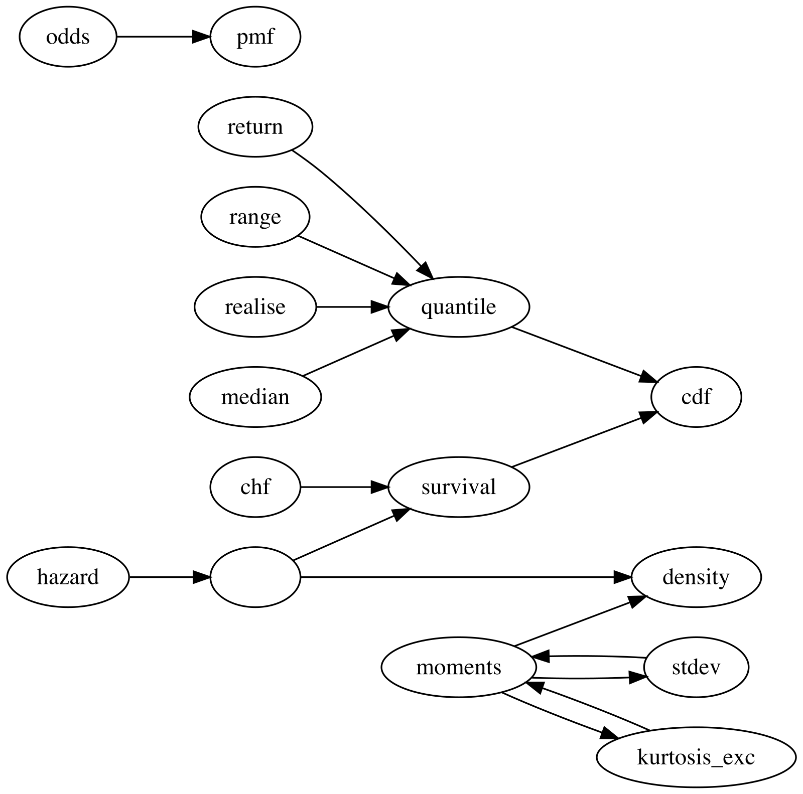

```{r, include = FALSE}
knitr::opts_chunk$set(
  collapse = TRUE,
  comment = "#>"
)
```

```{r setup}
library(distionary)
```

This vignette explains how to create user-defined distributions using `distionary`.

## User-Defined Distributions

You can make your own distribution using the `distribution()` function. Specify distribution properties as name-value pairs, where the name is the distribution property. Distributional _representations_ like the cumulative distribution function (CDF) can be specified as functions.

```{r}
my_normal <- distribution(
  density = stats::dnorm,
  cdf = stats::pnorm,
  g = 9.81,
  another_representation = function(x) x^2,
  .support = continuous(c(-Inf, Inf))
)
# Inspect
my_normal
```

The usual evaluation framework can now be accessed, such as evaluating the CDF.

```{r}
eval_cdf(my_normal, at = c(0.2, 0.5, 0.7))
```

Even though the mean has not been specified, it can still be evaluated.

```{r}
mean(my_normal)
```

Some of the specified properties are special because they correspond to a property that's known to distionary -- in this example, `density` and `cdf`. (The distribution's support, and hence its range, comes from the `.support` argument described below.) In general, the special names can be identified as follows:

- The suffix following `eval_` for any distributional representation (e.g., `quantile` for `eval_quantile()`). These should be specified as functions.
- `realise` or `realize`, which is used to generate random samples from the distribution. This should be a function of the number of observations to draw.
- The same name as the `distionary` functions used to extract any other property (e.g., `mean` for `mean()`).

See the [Evaluate a Distribution](./evaluate.html) vignette for more details on these evaluation functions and the network of relationships between the understood properties. Note that, in the current version, specifying a `cdf` along with a `density` or `pmf` (probability mass function) is required for evaluating non-explicit properties.

That requirement is less arbitrary than it looks. Some properties carry the *whole* distribution: hand `distionary` a CDF and nothing has been lost, so everything else can be worked out from it. A property that does this is called a **representation**. Others keep only a piece. A mean of 1.5 is true of endlessly many distributions, and there is no route back from it to the one you meant.

Being a representation is a role a property plays, not a separate kind of thing. `cdf` is a property of a distribution and also a representation of it; `mean` is a property and nothing more. The network shown below is really a map of which properties keep enough to reach the others --- which is why its arrows leave the representations, and why a distribution described only by its mean can tell you so little.

In general, properties can be invoked by the more general function `eval_property()`, which is useful for accessing entries that are not known to `distionary`. For example, the user-defined property `g` can be accessed in this way.

```{r}
eval_property(my_normal, "g")
```

To use `eval_property()` to evaluate a function, arguments can be specified in the `...` argument.

```{r}
eval_property(my_normal, "another_representation", 1:4)
```

The `eval_property()` function is also useful for programmatically accessing distribution properties.

```{r}
properties <- c("mean", "variance")
lapply(properties, function(x) eval_property(my_normal, x))
```

## Distribution Attributes

Distribution metadata are stored as attributes, and are those arguments prefixed by `.` in the `distribution()` function.

- `.support`, as seen in the example starting this vignette, specifies the distribution's support -- the set on which it places probability -- using `continuous()`, `discrete()`, or `mixed()`. Every distribution needs one; the variable type (continuous, discrete, or mixed) and the range are *derived* from it. (The older `.vtype` argument, which took a string such as `"continuous"`, is defunct: a type does not say where the probability is, so it cannot stand in for a support. See the [The Support of a Distribution](./support.html) vignette.)
- `.name` allows you to give the distribution a name.
- `.parameters` allows you to specify values for the distribution's parameters as a list, if applicable. This version of `distionary` does not draw from these values, so it currently serves a similar function as the distribution's name.

```{r}
my_distribution <- distribution(
  cdf = pnorm,
  density = dnorm,
  .support = continuous(c(-Inf, Inf)),
  .name = "Special",
  .parameters = list(theta = 1.7, mat = diag(2), hello = "hi")
)
# Inspect
my_distribution
```

Retrieve the support, and the variable type derived from it:

```{r}
support(my_distribution)
vtype(my_distribution)
```

Retrieve the parameters:

```{r}
parameters(my_distribution)
```

You can also reset the parameters with `<-`. Lets give this distribution scalar parameters.

```{r}
parameters(my_distribution)[["mat"]] <- 1
parameters(my_distribution)[["hello"]] <- NULL
# Inspect the distribution
my_distribution
```

Retrieve the distribution's name with `pretty_name()`.

```{r}
pretty_name(my_distribution)
```

Names are "pretty" because they can also include the parameters in a compact way, when the parameters are scalars (which they now are):

```{r}
pretty_name(my_distribution, param_digits = 2)
```

## Example of a New Parametric Family

If you want to create your own parametric family, such as a distribution whose density decays linearly from `x=0` to `x=a`, you can do this by making a function that accepts the distribution parameter as an input, and outputs the distribution. Note that the CDF and density are specified, as required for continuous distributions, the support is given with `.support = continuous(c(0, a))`, and other metadata are specified with the arguments starting with `.`.

```{r}
dst_linear <- function(a) {
  # It helps to check that the parameter is valid.
  checkmate::assert_number(a, lower = 0)
  # We'll create some representations outside of the `distribution()`
  # call for separation of concerns. Note that care is taken to ensure
  # proper behaviour outside of the range of the distribution.
  density <- function(x) {
    d <- 2 / a^2 * (a - x)
    d[x < 0 | x > a] <- 0
    d
  }
  cdf <- function(x) {
    p <- x / a^2 * (2 * a - x)
    p[x < 0] <- 0
    p[x > a] <- 1
    p
  }
  # Create the distribution.
  distribution(
    density = density,
    cdf = cdf,
    .support = continuous(c(0, a)),
    .name = "Linear",
    .parameters = list(a = a)
  )
}
```

Notice how the distribution metadata gets printed with the distribution.

```{r}
dst_linear(3)
```

Here are the density plots of different members of this family.

```{r}
plot(dst_linear(1), to = 4, col = "purple")
plot(dst_linear(2), add = TRUE, col = "red")
plot(dst_linear(4), add = TRUE, col = "blue")
legend(
  "topright",
  legend = c("a = 1", "a = 2", "a = 4"),
  col = c("purple", "red", "blue"),
  lty = 1
)
```

As usual, properties can be evaluated, even if they are not specified. Consider, for example, calculating return periods of three different Linear distributions.

```{r}
enframe_return(
  model1 = dst_linear(1),
  model2 = dst_linear(2),
  model3 = dst_linear(4),
  at = c(2, 5, 10, 20, 50, 100),
  arg_name = "return_period"
)
```

## Network of Properties

The key innovation in `distionary` is its network-based approach to probability distributions. Different distributional representations (CDF, PDF/PMF, quantile function, survival function, etc.) are interconnected through a network of mathematical relationships.

The diagram below shows how `distionary` derives distribution properties from other properties. An arrow from one property to another indicates that the first property can be calculated from the second. For example, `quantile` can be calculated from `cdf`, and `mean` can be calculated from `density`. This network structure is what allows you to define a custom distribution with just one or two representations (like `cdf` and `density` in the example above) and still have access to all other properties.

<!-- 
Network diagram generated using man/figures/network_diagram.R script.
The script uses DiagrammeR and Graphviz DOT language to create the diagram.
To regenerate: Rscript man/figures/network_diagram.R
-->

```{r, echo=FALSE, out.width="100%", fig.align="center"}

```

## Making your own properties

Some properties are easy to make yourself. Here is an example of a function that calculates interquartile range.

```{r}
# Make a function that takes a distribution as input, and returns the
# interquartile range.
iqr <- function(distribution) {
  diff(eval_quantile(distribution, at = c(0.25, 0.75)))
}
```

Apply the function to a Linear distribution as defined before.

```{r}
iqr(dst_linear(2))
```

For properties that are not handled by `distionary` (e.g., extreme value index, or moment generating function), one option is to build these properties into your own distribution. A future version of `distionary` will make user-defined properties easier to work with.

## Limitations

The `distionary` package is still young. Lots of helpful features are still missing, and your patience is appreciated as more features are developed. Some examples follow.

| #  | Limitation | Explanation |
|----|------------|------|
| 1. | Numerically computed moments of a distribution with infinitely many atoms rely on the tail contributing negligibly, and return `NaN` if that never happens. | The atoms are summed by walking outward through the support (via the `discretes` package). The walk stops only once the probability still ahead of it has been spent, which the CDF says exactly, *and* the atoms underfoot are contributing negligibly. The first is a real bound; the second is a reading of what has just been passed, and a distribution whose contributions vanish while its probability does not --- a heavy tail --- cannot be settled either way, so it returns `NaN`. |
| 2. | Representations are not checked for accuracy in this version. | While this is done in the test suite for the built-in distributions, additional levels of detail are required when accepting a foreign distribution. One consequence is worth knowing: a numerical moment over atoms uses the CDF to tell how much probability is still ahead of it, so a CDF that disagrees with the PMF can leave the sum unable to settle, and it returns `NaN`. |
| 3. | Typos when specifying distribution property names (e.g. `densty` instead of `density`) or variable type (e.g., `"contnous"` instead of `"continuous"`) will not trigger an error. | The package does not assume that distribution properties and types are limited, allowing for flexibility. |
| 4. | It is currently assumed that the distributional representations are specified in a way that remains valid beyond the range of the distribution. | A future version aims to use the specified range to automatically implement appropriate behavior. |


