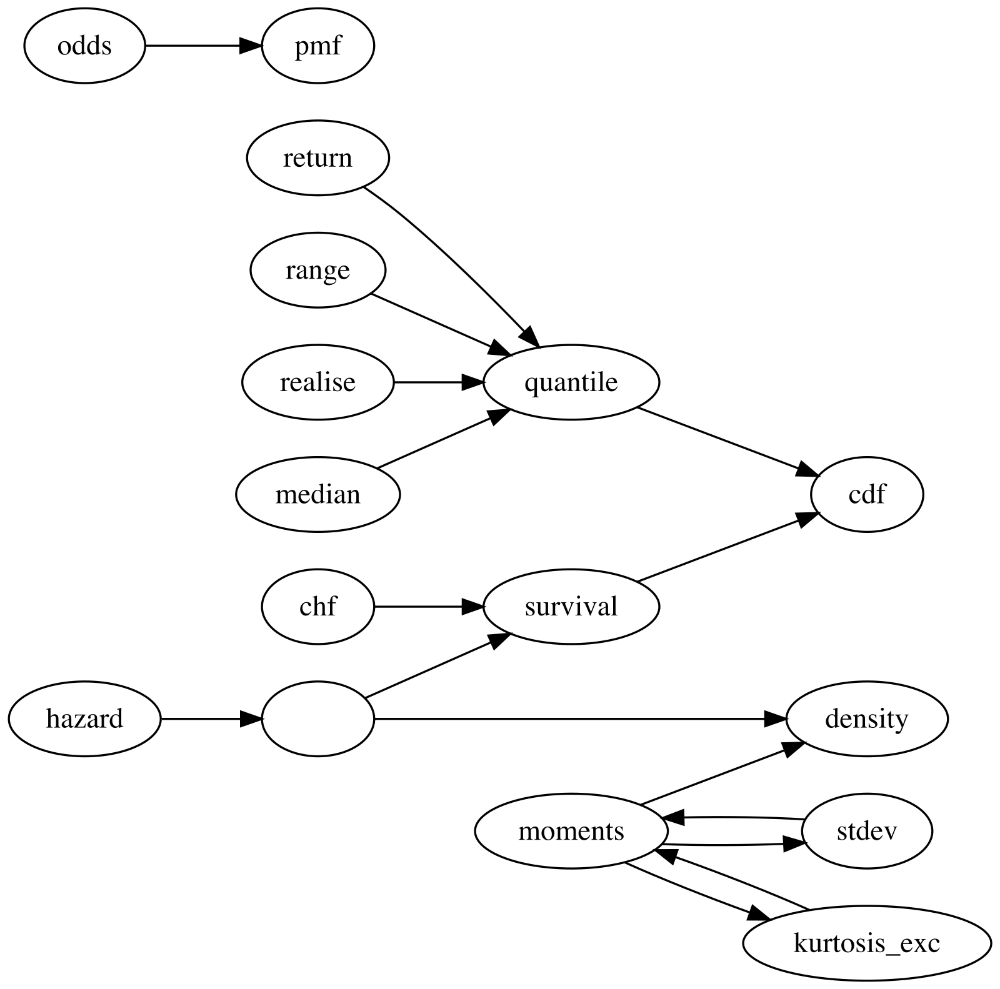

```{r, include = FALSE}
knitr::opts_chunk$set(
  collapse = TRUE,
  comment = "#>"
)
```

```{r setup}
library(distionary)
```

This vignette covers the first goal of `distionary`: to provide a framework for _creating_ a distribution, either one of the built-in distributions, or your own. 

## Built-In Distribution Families

All distribution families found in the `stats` package are made available with `distionary`, along with a few others. All families are shown in the following table.

| Distribution                     | `distionary` Function  |  Has counterpart in `stats` |
|----------------------------------|------------------------|-----------------------------|
| Bernoulli | `dst_bern()` | Yes |
| Beta | `dst_beta()` | Yes |
| Binomial | `dst_binom()` | Yes |
| Cauchy | `dst_cauchy()` | Yes |
| Chi Squared | `dst_chisq()` | Yes |
| Degenerate | `dst_degenerate()` | No |
| Exponential | `dst_exp()` | Yes |
| F | `dst_f()` | Yes |
| Gamma | `dst_gamma()` | Yes |
| Geometric | `dst_geom()` | Yes |
| Generalised Extreme Value (GEV) | `dst_gev()` | No |
| Generalised Pareto (GP) | `dst_gp()` | No |
| Hypergeometric | `dst_hyper()` | Yes |
| Log Normal | `dst_lnorm()` | Yes |
| Log Pearson Type III | `dst_lp3()` | No |
| Negative Binomial | `dst_nbinom()` | Yes |
| Normal | `dst_norm()` | Yes |
| Pearson Type III | `dst_pearson3()` | No |
| Poisson | `dst_pois()` | Yes |
| Student _t_ | `dst_t()` | Yes |
| Uniform | `dst_unif()` | Yes |
| Weibull | `dst_weibull()` | Yes |

In addition, there is a special "Null" distribution object akin to a missing or unknown distribution. This is useful, for example, if an algorithm fails to return a distribution: instead of throwing an error, a Null distribution can be returned.

```{r}
# Make a Null distribution.
null <- dst_null()
# Inspect
null
```

A Null distribution always evaluates to NA:

```{r}
mean(null)
eval_pmf(null, at = 1:4)
```

Distributions with a counterpart in the `stats` package use the same functions from the package and the same parameter names. For instance, take a look at the source code defining the Normal distribution to see that the representations wrap the `stats::*norm()` family of functions.

```{r}
dst_norm
```


## User-Defined Distributions

You can make your own distribution using the `distribution()` function. Provide it with name-value pairs that will be stored with the object in a list. Some names have a special interpretation in `distionary` in that they may be leveraged to compute other properties that aren't specified in `distribution()`. These special names are:

- Any distributional representation `*` invoked by `eval_*()` (e.g., `quantile` for `eval_quantile()`). A _distributional representation_ is a mathematical function that completely defines a probability distribution.
- Any property (e.g., `mean` for `mean()`). A _property_ is a measurable characteristic that can be computed from a representation.

See the [Evaluate a Distribution](./evaluate.html) vignette for more details on these evaluation functions and the distinction between representations and properties.

For this version of `distionary`, it is mandatory to specify at least `cdf` in order for non-specified properties to be evaluated. For continuous or discrete distributions, `density` or `pmf` may also be needed.

Optionally, you can also specify an entry for `.parameters`, which should be a named list of parameters that define the distribution. These parameters are never used for distribution calculations, but are sometimes useful to keep track of for analysis. It is intended that a future version of `distionary` will refer to these parameters for its calculations, but will not break existing code. 

Here is an example distribution.

```{r}
# Make a continuous distribution
linear <- distribution(
  density = function(x) {
    d <- 2 * (1 - x)
    d[x < 0 | x > 1] <- 0
    d
  },
  cdf = function(x) {
    p <- 2 * x * (1 - x / 2)
    p[x < 0] <- 0
    p[x > 1] <- 1
    p
  },
  g = 9.81,
  another_representation = function(x) x^2,
  .vtype = "continuous",
  .name = "My Linear",
  .parameters = list(a = 1)
)
# Inspect
linear
```

The usual evaluation framework can now be accessed. For example, the CDF and mean can be evaluated, even though the mean has not been specified.

```{r}
eval_cdf(linear, at = c(0.2, 0.5, 0.7))
mean(linear)
```

These quantities can be invoked by the more general function `eval_property()`.

```{r}
eval_property(linear, "cdf", c(0.2, 0.5, 0.7))
eval_property(linear, "mean")
```

`eval_property()` is a useful function for accessing quantities that are not built-in to `distionary`, like `g` and `another_representation` in this example.

```{r}
eval_property(linear, "another_representation", 1:4)
eval_property(linear, "g")
```

## Network of Properties

The key innovation in `distionary` is its network-based approach to probability distributions. Different distributional representations (CDF, PDF/PMF, quantile function, survival function, etc.) are interconnected through a network of mathematical relationships. This means you can specify a distribution using _any_ available representation, and `distionary` will automatically derive other representations and properties as needed.

The diagram below shows how `distionary` derives distribution properties from other properties. An arrow from one property to another indicates that the first property can be calculated from the second. For example, `quantile` can be calculated from `cdf`, and `mean` can be calculated from `density`. This network structure is what allows you to define a custom distribution with just one or two representations (like `cdf` and `density` in the example above) and still have access to all other properties.

<!-- 
Network diagram generated using man/figures/network_diagram.R script.
The script uses DiagrammeR and Graphviz DOT language to create the diagram.
To regenerate: Rscript man/figures/network_diagram.R
-->

```{r, echo=FALSE, out.width="100%", fig.align="center"}

```
